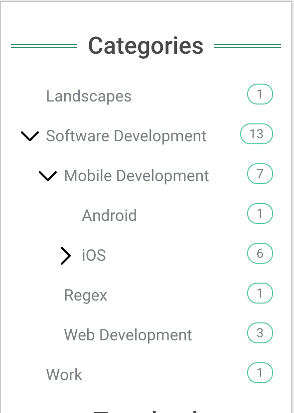
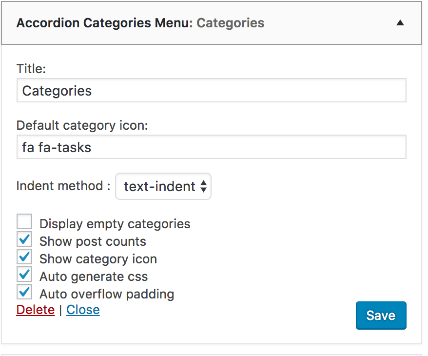
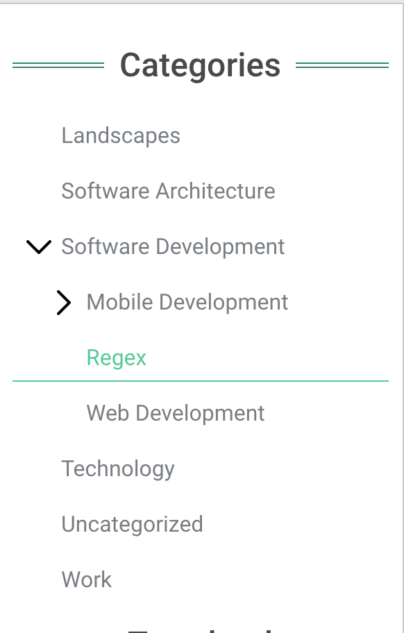
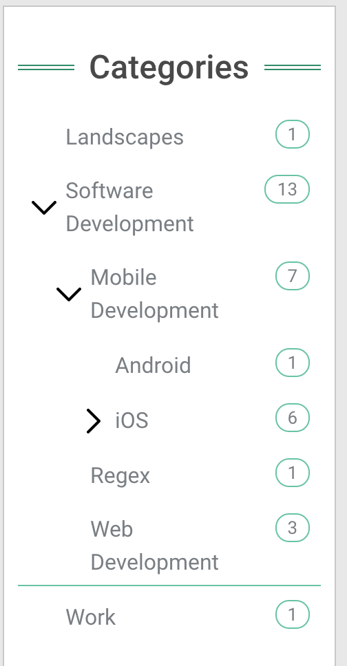
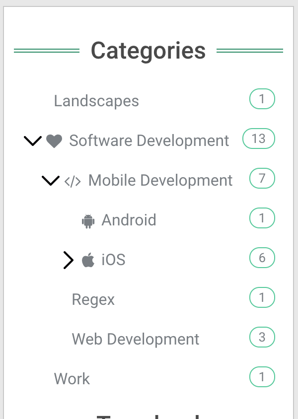

Accordion Categories is a Wordpress widget that allows you to display categories in hierachical order

Description
------------

Accordion Categories allows you to show categories menu in a sidebar. Each widget can be configured according to your needs.
This widget helps visitors of your site to navigate through categories easily. Auto overflow style generation is supported.

Main Features
-------------

The major features of Accordion Categories include:

* Display categories hierarchically.
* Show/hide empty categories (without any post).
* Show/hide a category post count (number of post associated with a category) including all children categories
* Show categories icons (using filter)
* Auto overflow padding, used for creating styles dynamically in order to prevent text overflow

Installation
------------

1. Upload the entire `accordion-categories` folder to the `/wp-content/plugins/` directory.
2. Activate the plugin through the 'Plugins' menu in WordPress.
3. Use `Accordion Categories Menu` widget in any registered sidebar `Appearance->Widgets`

Screenshots
-----------

Widget appearance

Widget configuration

Show empty categories

Autoverflow padding

With category icons

License
-------

    Copyright 2017 Alexander Molochko

    Licensed under the Apache License, Version 2.0 (the "License");
    you may not use this file except in compliance with the License.
    You may obtain a copy of the License at

       http://www.apache.org/licenses/LICENSE-2.0

    Unless required by applicable law or agreed to in writing, software
    distributed under the License is distributed on an "AS IS" BASIS,
    WITHOUT WARRANTIES OR CONDITIONS OF ANY KIND, either express or implied.
    See the License for the specific language governing permissions and
    limitations under the License.
